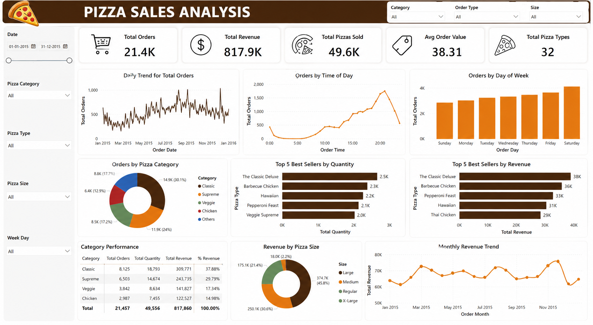

# 🍕 Pizza Sales Analytics Dashboard | SQL & Data Analysis

<p align="center">
  
  
  
</p>

---

## 📌 Project Overview

This project focuses on analyzing pizza sales data using SQL to uncover valuable business insights. By performing exploratory data analysis, revenue calculations, trend analysis, and performance evaluation, the project helps identify customer preferences and sales patterns.

The results are presented through an interactive analytics dashboard, making business insights easier to understand and interpret.

---

## 🎯 Objectives

* Analyze overall sales performance
* Identify top-performing pizza categories
* Discover customer ordering patterns
* Track revenue trends over time
* Evaluate product performance
* Generate business-driven insights

---

## 🛠️ Tools & Technologies

| Tool             | Purpose                 |
| ---------------- | ----------------------- |
| MySQL            | Data Storage & Querying |
| SQL              | Data Analysis           |
| Excel / Power BI | Dashboard Visualization |
| GitHub           | Project Hosting         |

---

## 🗂️ Database Schema

### Tables Used

#### Orders

* order_id
* order_date
* order_time

#### Order Details

* order_details_id
* order_id
* pizza_id
* quantity

#### Pizzas

* pizza_id
* pizza_type_id
* size
* price

#### Pizza Types

* pizza_type_id
* name
* category

---

## 📊 Dashboard Preview

### Pizza Sales Analytics Dashboard



The dashboard provides:

✅ Total Revenue

✅ Total Orders

✅ Total Pizzas Sold

✅ Average Order Value

✅ Revenue by Category

✅ Revenue Trends

✅ Top Selling Pizzas

✅ Pizza Size Analysis

✅ Daily & Hourly Order Patterns

---

## 📈 Business Questions Solved

### Basic Analysis

* Total number of orders placed
* Total revenue generated
* Highest priced pizza
* Most common pizza size ordered
* Top 5 most ordered pizza types

### Intermediate Analysis

* Quantity sold by category
* Orders by hour
* Category-wise distribution
* Average daily orders
* Revenue ranking of pizzas

### Advanced Analysis

* Revenue contribution percentage
* Cumulative revenue analysis
* Top pizzas by category
* Window function analysis
* Ranking analysis

---

## 🔍 SQL Concepts Applied

```sql
JOINS
GROUP BY
ORDER BY
AGGREGATE FUNCTIONS
SUBQUERIES
WINDOW FUNCTIONS
RANK()
SUM() OVER()
```

---

## 💡 Key Insights

📌 Large-sized pizzas generated the highest revenue.

📌 Weekend sales were significantly higher than weekdays.

📌 Classic category pizzas contributed the largest share of revenue.

📌 A small group of pizza varieties generated a major portion of total sales.

📌 Evening hours recorded peak customer activity.

---

## 📁 Project Structure

```text
Pizza-Sales-Analysis/
│
├── dataset/
│   ├── orders.csv
│   ├── pizzas.csv
│   ├── pizza_types.csv
│   └── order_details.csv
│
├── sql/
│   └── pizza_sales_analysis.sql
│
├── screenshots/
│   └── dashboard.png
│
└── README.md
```

---

## 🚀 Project Outcome

This project demonstrates how SQL can be used to transform raw transactional data into actionable business insights. The combination of SQL analysis and dashboard visualization helps stakeholders understand sales performance and make data-driven decisions.

---

## 👨‍💻 Author

**Shivansh Deshwal**

Data Science Student | SQL | Data Analytics | Machine Learning

GitHub: https://github.com/Shivansh-3010
